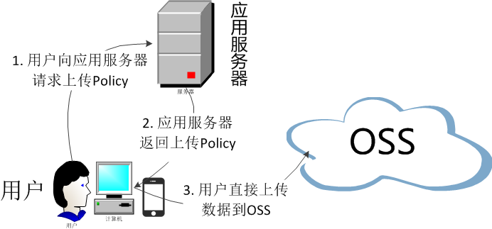

#	Web 端 MD Player 说明文档

####	1. 介绍


####	2. 要求

* 开通 MD 服务，如果您还没不了解 MD 服务，请登录产品主页了解。
* 获取 AK 和 SK， 使用服务端鉴权， 根据 AK 和 SK 拿到 Token。


* 浏览器最低版本要求：
   * Chrome 49
   * Firefox 52
   * Safari 11
   * IOS Safari 11
   * Eage 15

  

####	3. 开始入门

#####	3.1 安装

```
$ npm install md-player
```

or:

```html
<script src="http://md-player.com/web-sdk-1.0.0.min.js"></script>
```


#####	3.2 使用

```javascript
import MDPlayer from 'MDPlayer';
let mdPlayer = new MDPlayer('#video', {
  video: {
    class: 'video-class',
    // 支持 RTSP/STMP
    src: '<video url>',
    autoplay: true,
    playsinline: true,
  },
  getToken(cb) {
    // 从服务端获取的Token
    return '<token>' || '<Promise>';
  },
});
mdPlayer.play();
```


####	4. 服务端鉴权

#####	4.1 背景

采用JS客户端直接签名有一个很严重的安全隐患，AK/SK 暴露在前端页面，其他人可以随意拿到AK/SK，这是非常不安全的做法。

服务端鉴权逻辑图如下：

       	1. 客户端调用播放器时，到应用服务器拿取一次性签名凭证 Token。
        	2. 客户端拿到 Token 直接与媒体服务器通信播放视频。





#####	4.2 生成 Token：

此代码应放在服务端，通过调用接口返回。

```javascript
// 注意：为确保客户端、业务服务器和本服务器对于授权截止时间的理解保持一致，需要同步校准各自的时钟。频繁返回 NO_AUTH_TOKEN 状态码时请先检查时钟同步性与生成 deadline 值的代码逻辑。

import hmacsha1 from 'hmacsha1';

const AK = '<AK>';
const SK = '<SK>';

let strategy = JSON.stringify({
  // 凭证有效截止时间。Unix时间戳，单位为毫秒。
  deadline: new Date().getTime(),
});
// 使用URL安全的Base64编码鉴权策略。
strategy = strategy.replace(/\+/g, '-').replace(/\//g, '_')

// 使用SK对上一步生成的待签名字符串计算HMAC-SHA1签名，并对签名进行URL安全的Base64编码。
let encodedPolicy = hmacsha1(SK, strategy).replace(/\+/g, '-').replace(/\//g, '_');

// 将 AK、encodedSign 和 encodedPolicy 用英文符号 : 连接起来。
const token = [AK, SK, encodedPolicy].json(':');
```


####	4. API

####	5. 版本与更新

####	6. 反馈