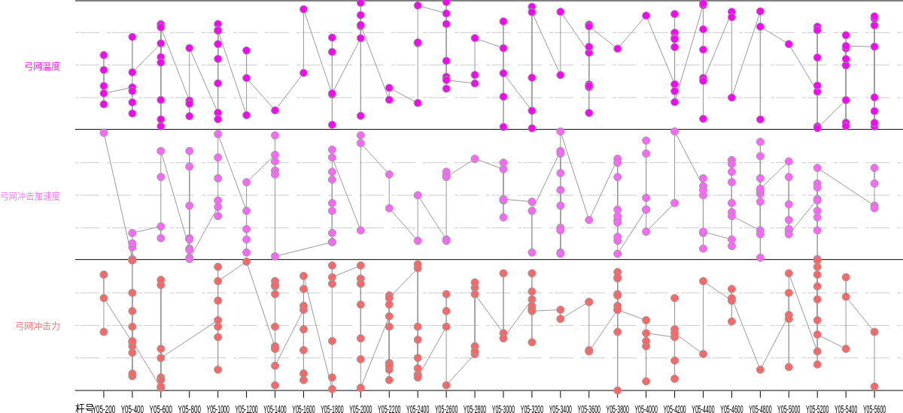

#	Many point chart


## 简介

说明：本项目是一个支持Ｙ轴多个坐标点图表，它使用原生Canvas开发，使用Rollup打包。

示例：[查看地址](https://jianglin-wu.github.io/many-point-chart/)




## 快速入门

**安装**

通过 npm/yarn 进行模块安装：

```shell
$ npm install many-point-chart
```

通过 `<script>` 方式引入：

```javascript
<script src="lib/many-point-chart.js"></script>
// or
<script src="lib/many-point-chart.min.js"></script>
```


## 使用

### 配置

配置参数

```javascript
const options = {
  // 刻度栏
  scale: {
    title: '名称', // 刻度栏名称
    keyName: 'attribute.keyName', // 传入数据的 keyName
    height: 30,
  },
  // 图表
  chart: {
    gridSpacingY: 20, // 虚线的行距
    offsetLeft: 100, // 左偏移值
    // tablesHeight: 300, // 图表高度，默认高度撑满
    // 图表列表
    tables: [
      {
        title: '弓网温度', // 左侧名称
        keyName: 'tempVals', // 数组内对象的键名
        fillStyle: '#ff00ff', // 填充颜色
        strokeStyle: '#ff00ff', // 线条颜色
        pointRadius: 1, // 坐标点半径
        min: 0, // 该键值的最小值
        max: 101, // 该键值的最大值
      },
      {
        title: '弓网冲击加速度',
        keyName: 'accelerations',
        fillStyle: '#ff66ff',
        strokeStyle: '#ff66ff',
        pointRadius: 1,
        min: 0,
        max: 100,
      },
      // ……
    ],
  },
}
```


数据的格式

```javascript
const data = [
  {
    attribute: {
      keyName: 'name-1', // 每个刻度的名称
    },
    // 表格坐标值
    tempVals: [
      10,
      80,
      30,
    ],
    accelerations: [
      88,
      60,
      70,
      50,
    ],
  },
  // ……
]
```


### 绘制图表

ES6 方式使用:

```javascript
import ManyPoint from 'many-point-chart'
const chart = new ManyPoint('canvas-id', {
  width: 1200, // 画布宽度
  height: 600, // 画布高度
})
chart.draw(
  options, // 选项
  data, // 数据
)
```

html 中使用

```html
<script>
  // window.ManyPoint
  var chart = new ManyPoint('canvas-id', {
    // ……
  });
  chart.draw(options,data);
</script>

```


### 方法

* draw(options, data): 绘制图表，第一个参数为配置参数，第二个参数为传入的数据。
* on(eventName, fn): 注册事件监听，第一个参数为事件名称，第二个参数为触发运行函数。
* clear(): 清除画板。
* removeEvents(): 清楚所有事件。


### 事件

* canvas 事件：以下事件触发会传入原生的 event 参数。
  * click
  * mouseenter
  * mousemove
  * mouseleave


* 单张图表事件：以下事件触发除 tableMouseleave 外，其他事件接收三个参数（event, location, indexs），分别为 event 参数，位置信息，索引信息。
  * tableClick
  * tableMouseenter
  * tableMousemove
  * tableMouseleave


* 坐标轴事件：以下事件触发除 axisXMouseleave 外，其他事件接收三个参数（event, location, indexs），分别为 event 参数，位置信息，索引信息。
  * axisXClick
  * axisXMouseenter
  * axisXMousemove
  * axisXMouseleave


* 坐标点事件：以下事件触发除 pointMouseleave 外，其他事件接收三个参数（event, location, indexs），分别为 event 参数，位置信息，索引信息。
  * pointClick
  * pointMouseenter
  * pointMousemove
  * pointMouseleave

